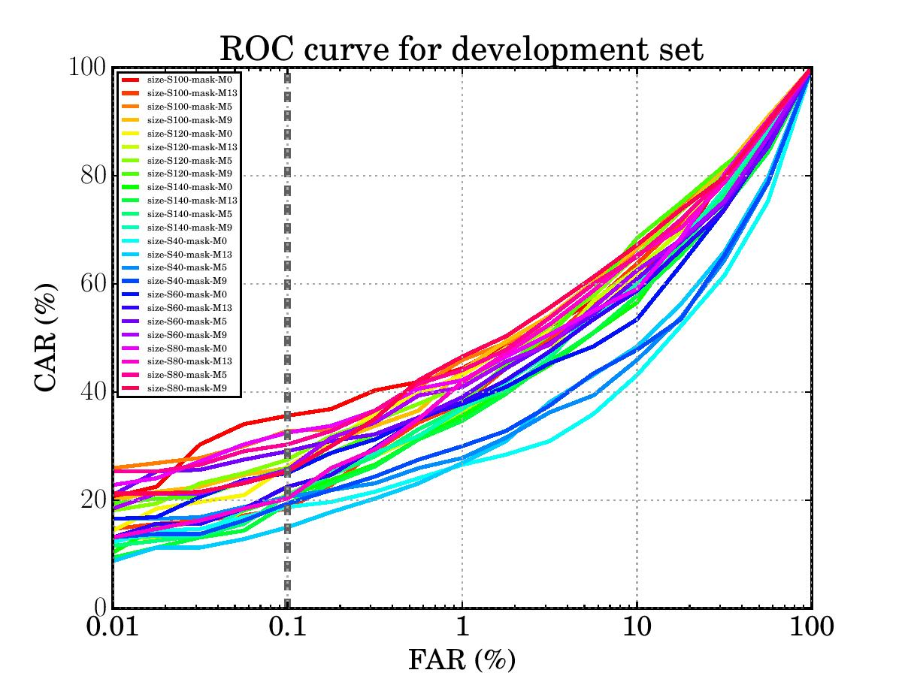

.. vim: set fileencoding=utf-8 :

.. _bob.bio.vein.results-biowave-v1:

============================================
Baseline experiments for BIOWAVE V1 database
============================================

Introduction
------------

In this page is summarized baseline experiment results on `BioWave V1`_ database. More information -- :py:mod:`bob.bio.vein.configurations.biowave_v1` and also -- `BioWave V1`_ .

Fully-automated experiments
---------------------------

The baseline verification results are summarized in this section. 
The evaluation of verification pipe-lines is done in two steps:

  1. First, the papameters of each algorithm are adjusted using the grid search on the ``Idiap_1_1_R`` protocol of ``biowave_v1_a`` instance of the `BioWave V1`_ database. 
     Only ``'dev'`` set of the database is used in the grid search.
  2. Once best parameters are selected the performance is comuted for 
     ``Idiap_1_1_R``, ``Idiap_1_5_R``, ``Idiap_5_5_R`` protocols of the `BioWave V1`_ database.

Maximum Curvature Features + Miura Matching Algorithm
********************************************************

**Evaluated verification pipe-line:**

  \{ ``KMeansRoi`` or ``TopographyCutRoi`` \} Preprocessor + ``MaximumCurvature`` Extractor + ``MiuraMatch`` Algorithm

In the first sequence of experiments the best performing ``Preprocessor`` is selected. 
The following options are iteratively passed to the verification algorithm (arguments for the ``verify.py`` script):

  1. ``--preprocessor`` \{ ``kmeans-roi``, ``kmeans-roi-conv``, ``kmeans-roi-conv-erode-40``, 
     ``topography-cut-roi``, ``topography-cut-roi-conv``, ``topography-cut-roi-conv-erode`` \}
  2. ``--extractor maximumcurvature``
  3. ``--algorithm miura-match-wrist-100``

The results are summarized in the following Table:

EER for the ``'dev'`` set, ``Idiap_1_1_R`` protocol of ``biowave_v1_a`` instance of the `BioWave V1`_ database.

+-----------------------------------+----------+
|          ``Preprocessor``         |  EER,\%  |
+===================================+==========+
|           ``kmeans-roi``          |  24.375  |
+-----------------------------------+----------+
|        ``kmeans-roi-conv``        |  25.625  |
+-----------------------------------+----------+
|    ``kmeans-roi-conv-erode-40``   |  26.250  |
+-----------------------------------+----------+
|       ``topography-cut-roi``      |  22.188  |
+-----------------------------------+----------+
|    ``topography-cut-roi-conv``    |  25.938  |
+-----------------------------------+----------+
| ``topography-cut-roi-conv-erode`` |  27.837  |
+-----------------------------------+----------+

The ROC curves for the particular experiment can be downlooaded from here:

:download:`ROC curve `

Based on the inspection of ROC curves k-means-based ROI extraction algorithms outperform the topography-cut-based methods. 
The lowest EER among k-means-based ROI approaches is obtained for ``kmeans-roi``, therefore upcoming experiments incorporate this method in the preprocessing stage. 

In the second sequence of experiments the best performing ``Algorithm`` is selected. 
The following options are iteratively passed to the verification algorithm (arguments for the ``verify.py`` script):

  1. ``--preprocessor kmeans-roi``
  2. ``--extractor maximumcurvature``
  3. ``--algorithm`` \{ ``miura-match-wrist-20``, ``miura-match-wrist-40``, ``miura-match-wrist-60``, ``miura-match-wrist-80``, 
     ``miura-match-wrist-100``, ``miura-match-wrist-120``, ``miura-match-wrist-140``, ``miura-match-wrist-160`` \}

Options in the ``--algorithm`` stage represent the search region in the Miura matching algorithm, which is iteratively increased from 20 to 160 pixels in both X and Y directions.

The results are summarized in the following Table:

EER for the ``'dev'`` set, ``Idiap_1_1_R`` protocol of ``biowave_v1_a`` instance of the `BioWave V1`_ database.

+------------------------------+----------+
|         ``Algorithm``        |  EER,\%  |
+==============================+==========+
|   ``miura-match-wrist-20``   |  37.812  |
+------------------------------+----------+
|   ``miura-match-wrist-40``   |  34.062  |
+------------------------------+----------+
|   ``miura-match-wrist-60``   |  29.375  |
+------------------------------+----------+
|   ``miura-match-wrist-80``   |  25.312  |
+------------------------------+----------+
|   ``miura-match-wrist-100``  |**24.375**|
+------------------------------+----------+
|   ``miura-match-wrist-120``  |  24.688  |
+------------------------------+----------+
|   ``miura-match-wrist-140``  |  25.938  |
+------------------------------+----------+
|   ``miura-match-wrist-160``  |  28.438  |
+------------------------------+----------+

The ROC curves for the particular experiment can be downlooaded from here:

:download:`ROC curve `

According to the above table the optimal search region in the Miura Matching algorithm is 100 pixels (both horizontal and vertical directions).
This hyperparameter is now also fixed in the next sequence of grid-search experiments.

In the third sequence of experiments the morphological dilation of the vein patterns is evaluated. 
In this scenario the veins are first dilated with disk shaped kernel and then Miura matching is applied.
The following options are iteratively passed to the verification algorithm (arguments for the ``verify.py`` script):

  1. ``--preprocessor kmeans-roi``
  2. ``--extractor maximumcurvature``
  3. ``--algorithm`` \{ ``miura-match-wrist-dilation-5``, ``miura-match-wrist-dilation-7``, ``miura-match-wrist-dilation-9``, 
     ``miura-match-wrist-dilation-11``, ``miura-match-wrist-dilation-13``, ``miura-match-wrist-dilation-15``, ``miura-match-wrist-dilation-17`` \}

Number in the ``--algorithm`` names represents the value of the diameter (in pixels) of the disk shaped kernel used for the dilation of the veins.

The results are summarized in the following Table:

EER for the ``'dev'`` set, ``Idiap_1_1_R`` protocol of ``biowave_v1_a`` instance of the `BioWave V1`_ database.

+--------------------------------------+----------+
|         ``Algorithm``                |  EER,\%  |
+======================================+==========+
|   ``miura-match-wrist-dilation-5``   |**24.083**|
+--------------------------------------+----------+
|   ``miura-match-wrist-dilation-7``   |  24.367  |
+--------------------------------------+----------+
|   ``miura-match-wrist-dilation-9``   |  24.724  |
+--------------------------------------+----------+
|   ``miura-match-wrist-dilation-11``  |  25.625  |
+--------------------------------------+----------+
|   ``miura-match-wrist-dilation-13``  |  26.562  |
+--------------------------------------+----------+
|   ``miura-match-wrist-dilation-15``  |  28.125  |
+--------------------------------------+----------+
|   ``miura-match-wrist-dilation-17``  |  30.000  |
+--------------------------------------+----------+

The ROC curves for the particular experiment can be downlooaded from here:

:download:`ROC curve `

Based on the above results the best perfoming verification pipe-line is composed of the following modules:

  ``kmeans-roi`` Preprocessor + ``maximumcurvature`` Extractor + ``miura-match-wrist-dilation-5`` Algorithm

The best performing combination of algorithms is next tested on ``Idiap_1_1_R``, ``Idiap_1_5_R``, ``Idiap_5_5_R`` protocols of the `BioWave V1`_ database.

The results are summarized in the Table below.

EER (``'dev'`` set), HTER (``'eval'`` set), different protocols of the `BioWave V1`_ database.

+---------------------+----------+----------+
|      Protocol       |  EER,\%  |  HTER,\% |
+=====================+==========+==========+
|   ``Idiap_1_1_R``   |  24.960  |  24.313  |
+---------------------+----------+----------+
|   ``Idiap_1_5_R``   |  23.650  |  23.346  |
+---------------------+----------+----------+
|   ``Idiap_5_5_R``   |**16.638**|**16.156**|
+---------------------+----------+----------+

The ROC curves for the particular experiment can be downlooaded from here:

:download:`ROC curve `

LBP/MCT histograms + histograms matching
*****************************************

**Evaluated verification pipe-line:**

  ``KMeansRoi`` Preprocessor + ``MaskedLBPHistograms`` Extractor + ``HistogramsMatch`` Algorithm

In the first sequence of experiments the best performing ``Extractor`` is selected. 
The following options are iteratively passed to the verification algorithm (arguments for the ``verify.py`` script):

  1. ``--preprocessor kmeans-roi``
  2. ``--extractor`` { ``mct-histogram-n8r2``, ``mct-histogram-n8r3``, ``mct-histogram-n8r4``, ``mct-histogram-n8r5``, ``mct-histogram-n8r6``, ``mct-histogram-n8r7`` }
  3. ``--algorithm chi-square``

Digits in the ``--extractor`` names represent the parameters (number of neighbouring points and radius) of the LBP/MCT feature extractors.

The results are summarized in the following Table:

EER for the ``'dev'`` set, ``Idiap_1_1_R`` protocol of ``biowave_v1_a`` instance of the `BioWave V1`_ database.

+----------------------------+----------+
|        ``Extractor``       |  EER,\%  |
+============================+==========+
|   ``mct-histogram-n8r2``   |  32.432  |
+----------------------------+----------+
|   ``mct-histogram-n8r3``   |  32.188  |
+----------------------------+----------+
|   ``mct-histogram-n8r4``   |  31.174  |
+----------------------------+----------+
|   ``mct-histogram-n8r5``   |  30.312  |
+----------------------------+----------+
|   ``mct-histogram-n8r6``   |  29.688  |
+----------------------------+----------+
|   ``mct-histogram-n8r7``   |**29.063**|
+----------------------------+----------+

The ROC curves for the particular experiment can be downlooaded from here:

:download:`ROC curve `

Based on the above results the best perfoming verification pipe-line is composed of the following modules:

  ``kmeans-roi`` Preprocessor + ``mct-histogram-n8r7`` Extractor + ``chi-square`` Algorithm

The best performing combination of algorithms is next tested on ``Idiap_1_1_R``, ``Idiap_1_5_R``, ``Idiap_5_5_R`` protocols of the `BioWave V1`_ database.

The results are summarized in the Table below.

EER (``'dev'`` set), HTER (``'eval'`` set), different protocols of the `BioWave V1`_ database.

+---------------------+----------+----------+
|      Protocol       |  EER,\%  |  HTER,\% |
+=====================+==========+==========+
|   ``Idiap_1_1_R``   |  29.002  |  30.821  |
+---------------------+----------+----------+
|   ``Idiap_1_5_R``   |  28.852  |  30.616  |
+---------------------+----------+----------+
|   ``Idiap_5_5_R``   |**25.588**|**27.494**|
+---------------------+----------+----------+

The ROC curves for the particular experiment can be downlooaded from here:

:download:`ROC curve `

Annotation comparison
---------------------

In this section annotation comparison results are summarized.

Protocol ``Idiap_1_1_R``
************************

Algorithm - ``AnnotationMatch``, ``not centred`` annotations.

+-------------------------------------+---------------+--------------+---------------+
|  Algorithm - ``AnnotationMatch``    | ``EER`` using different score fusion methods |
+-------------------------------------+---------------+--------------+---------------+
|        Algorithm parameters         |   ``mean``    |   ``min``    |   ``max``     |
+=====================================+===============+==============+===============+
|                        ``sigma = 0``|    47.500%    |    43.417%   |    50.353%    |
+-------------------------------------+---------------+--------------+---------------+
|                        ``sigma = 1``|    48.125%    |    42.540%   |    51.562%    |
+-------------------------------------+---------------+--------------+---------------+
|                        ``sigma = 2``|    47.736%    |    43.125%   |    51.562%    |
+-------------------------------------+---------------+--------------+---------------+
|                        ``sigma = 3``|    47.500%    |    43.201%   |    51.562%    |
+-------------------------------------+---------------+--------------+---------------+
|                        ``sigma = 4``|    47.812%    |    43.069%   |    52.175%    |
+-------------------------------------+---------------+--------------+---------------+
|                        ``sigma = 5``|    47.873%    |    42.188%   |    53.438%    |
+-------------------------------------+---------------+--------------+---------------+
|                        ``sigma = 6``|    47.500%    |    41.603%   |    53.758%    |
+-------------------------------------+---------------+--------------+---------------+
|                        ``sigma = 7``|    47.812%    |  **41.310%** |    54.062%    |
+-------------------------------------+---------------+--------------+---------------+

Algorithm - ``AnnotationMatch``, ``centred`` annotations.

+-------------------------------------+---------------+--------------+---------------+
|  Algorithm - ``AnnotationMatch``    | ``EER`` using different score fusion methods |
+-------------------------------------+---------------+--------------+---------------+
|        Algorithm parameters         |   ``mean``    |   ``min``    |   ``max``     |
+=====================================+===============+==============+===============+
|                        ``sigma = 0``|   43.750%     |   39.375%    |   47.812%     |
+-------------------------------------+---------------+--------------+---------------+
|                        ``sigma = 1``|   42.476%     |   38.510%    |   46.875%     |
+-------------------------------------+---------------+--------------+---------------+
|                        ``sigma = 2``|   40.625%     |   36.875%    |   46.186%     |
+-------------------------------------+---------------+--------------+---------------+
|                        ``sigma = 3``|   38.750%     |   35.337%    |   45.389%     |
+-------------------------------------+---------------+--------------+---------------+
|                        ``sigma = 4``|   38.706%     |   33.125%    |   44.744%     |
+-------------------------------------+---------------+--------------+---------------+
|                        ``sigma = 5``|   37.576%     |   32.188%    |   45.000%     |
+-------------------------------------+---------------+--------------+---------------+
|                        ``sigma = 6``|   37.552%     | **31.875%**  |   45.312%     |
+-------------------------------------+---------------+--------------+---------------+
|                        ``sigma = 7``|   37.500%     | **31.875%**  |   45.373%     |
+-------------------------------------+---------------+--------------+---------------+

Algorithm - ``AnnotationMatch``, ``not centred`` **but** ``rotated`` annotations.

+-------------------------------------+---------------+--------------+---------------+
|  Algorithm - ``AnnotationMatch``    | ``EER`` using different score fusion methods |
+-------------------------------------+---------------+--------------+---------------+
|        Algorithm parameters         |   ``mean``    |   ``min``    |   ``max``     |
+=====================================+===============+==============+===============+
|                        ``sigma = 0``|    49.756%    |    44.375%   |    52.881%    |
+-------------------------------------+---------------+--------------+---------------+
|                        ``sigma = 1``|    49.928%    |    43.157%   |    53.990%    |
+-------------------------------------+---------------+--------------+---------------+
|                        ``sigma = 2``|    50.008%    |    43.121%   |    53.750%    |   
+-------------------------------------+---------------+--------------+---------------+
|                        ``sigma = 3``|    50.000%    |    42.812%   |    53.750%    |   
+-------------------------------------+---------------+--------------+---------------+
|                        ``sigma = 4``|    49.375%    |    42.500%   |    53.458%    |
+-------------------------------------+---------------+--------------+---------------+
|                        ``sigma = 5``|    49.451%    |    42.500%   |    53.125%    |
+-------------------------------------+---------------+--------------+---------------+
|                        ``sigma = 6``|    49.062%    |    42.496%   |    52.812%    |
+-------------------------------------+---------------+--------------+---------------+
|                        ``sigma = 7``|    49.062%    |  **42.428%** |    52.444%    |
+-------------------------------------+---------------+--------------+---------------+

Algorithm - ``AnnotationMatch``, ``centred`` **and** ``rotated`` annotations.

+-------------------------------------+---------------+--------------+---------------+
|  Algorithm - ``AnnotationMatch``    | ``EER`` using different score fusion methods |
+-------------------------------------+---------------+--------------+---------------+
|        Algorithm parameters         |   ``mean``    |   ``min``    |   ``max``     |
+=====================================+===============+==============+===============+
|                        ``sigma = 0``|    46.562%    |    41.631%   |    49.062%    |
+-------------------------------------+---------------+--------------+---------------+
|                        ``sigma = 1``|    45.312%    |    39.631%   |    48.750%    |
+-------------------------------------+---------------+--------------+---------------+
|                        ``sigma = 2``|    43.438%    |    37.232%   |    48.438%    |
+-------------------------------------+---------------+--------------+---------------+
|                        ``sigma = 3``|    40.000%    |    34.375%   |    47.500%    |
+-------------------------------------+---------------+--------------+---------------+
|                        ``sigma = 4``|    38.438%    |    32.812%   |    45.938%    |
+-------------------------------------+---------------+--------------+---------------+
|                        ``sigma = 5``|    37.500%    |    32.188%   |    45.661%    |
+-------------------------------------+---------------+--------------+---------------+
|                        ``sigma = 6``|    36.875%    |  **31.562%** |    45.240%    |
+-------------------------------------+---------------+--------------+---------------+
|                        ``sigma = 7``|    36.310%    |  **31.262%** |    45.000%    |
+-------------------------------------+---------------+--------------+---------------+

Algorithm - ``AnnotationMatch``, ``centred`` **but not** ``rotated`` annotations.

+-------------------------------------+---------------+--------------+---------------+---------------+---------------+
|   Algorithm - ``MiuraMatch``        |               ``EER`` using different ``dilation`` parameters                |
+-------------------------------------+---------------+--------------+---------------+---------------+---------------+
|        Algorithm parameters         |        0      |      5       |      9        |      13       |     17        |
+=====================================+===============+==============+===============+===============+===============+
|          ``ch = cw = 40``           |    26.250%    |   25.962%    |    24.948%    |    23.750%    |    23.750%    |
+-------------------------------------+---------------+--------------+---------------+---------------+---------------+
|          ``ch = cw = 60``           |    25.000%    |   23.429%    |    23.125%    |    22.504%    |    22.865%    |
+-------------------------------------+---------------+--------------+---------------+---------------+---------------+
|          ``ch = cw = 80``           |    23.750%    |   22.776%    |    22.812%    |    22.812%    |    22.232%    |
+-------------------------------------+---------------+--------------+---------------+---------------+---------------+
|          ``ch = cw = 100``          |    24.062%    |   22.188%    |    22.500%    |    23.125%    |    22.812%    | 
+-------------------------------------+---------------+--------------+---------------+---------------+---------------+
|          ``ch = cw = 120``          |    24.960%    |   23.125%    |    21.875%    |    22.188%    |    22.500%    |
+-------------------------------------+---------------+--------------+---------------+---------------+---------------+
|          ``ch = cw = 140``          |    26.562%    |   24.062%    |  **21.278%**  |    21.875%    |    23.057%    |
+-------------------------------------+---------------+--------------+---------------+---------------+---------------+
|          ``ch = cw = 160``          |    25.625%    |   23.718%    |    22.812%    |    22.188%    |    24.375%    |
+-------------------------------------+---------------+--------------+---------------+---------------+---------------+

Algorithm - ``MiuraMatch``, ``centred`` **and** ``rotated`` annotations.

+-------------------------------------+---------------+--------------+---------------+---------------+---------------+
|   Algorithm - ``MiuraMatch``        |               ``EER`` using different ``dilation`` parameters                |
+-------------------------------------+---------------+--------------+---------------+---------------+---------------+
|        Algorithm parameters         |        0      |      5       |      9        |      13       |     17        |
+=====================================+===============+==============+===============+===============+===============+
|          ``ch = cw = 40``           |     24.688%   |    23.177%   |    23.125%    |    23.438%    |    24.375%    |
+-------------------------------------+---------------+--------------+---------------+---------------+---------------+
|          ``ch = cw = 60``           |     22.812%   |    22.812%   |    22.188%    |    21.875%    |    23.125%    |
+-------------------------------------+---------------+--------------+---------------+---------------+---------------+
|          ``ch = cw = 80``           |     21.875%   |    22.188%   |    21.875%    |    22.188%    |    22.532%    |
+-------------------------------------+---------------+--------------+---------------+---------------+---------------+
|          ``ch = cw = 100``          |     22.508%   |    22.812%   |    21.903%    |    22.500%    |     23.438%   |
+-------------------------------------+---------------+--------------+---------------+---------------+---------------+
|          ``ch = cw = 120``          |     23.750%   |    21.562%   |  **20.625%**  |    21.831%    |     24.062%   |
+-------------------------------------+---------------+--------------+---------------+---------------+---------------+
|          ``ch = cw = 140``          |     24.062%   |    21.875%   |    20.938%    |    22.135%    |     23.510%   |
+-------------------------------------+---------------+--------------+---------------+---------------+---------------+
|          ``ch = cw = 160``          |     25.312%   |    22.812%   |    21.250%    |    22.188%    |     23.125%   |
+-------------------------------------+---------------+--------------+---------------+---------------+---------------+

Protocol ``Idiap_5_5_R``
************************

Algorithm - ``AnnotationMatch``, ``not centred`` annotations.

+-------------------------------------+---------------+--------------+---------------+
|  Algorithm - ``AnnotationMatch``    | ``EER`` using different score fusion methods |
+-------------------------------------+---------------+--------------+---------------+
|        Algorithm parameters         |   ``mean``    |   ``min``    |   ``max``     |
+=====================================+===============+==============+===============+
|                        ``sigma = 0``|    48.085%    |    45.000%   |    49.936%    |
+-------------------------------------+---------------+--------------+---------------+
|                        ``sigma = 1``|    48.758%    |    44.399%   |    50.497%    |
+-------------------------------------+---------------+--------------+---------------+
|                        ``sigma = 2``|    48.758%    |    44.399%   |    50.497%    |
+-------------------------------------+---------------+--------------+---------------+
|                        ``sigma = 3``|    47.500%    |    43.750%   |    51.354%    |
+-------------------------------------+---------------+--------------+---------------+
|                        ``sigma = 4``|    46.971%    |    43.125%   |    52.356%    |
+-------------------------------------+---------------+--------------+---------------+
|                        ``sigma = 5``|    46.995%    |    43.269%   |    51.250%    |
+-------------------------------------+---------------+--------------+---------------+
|                        ``sigma = 6``|    47.540%    |    43.021%   |    51.875%    |
+-------------------------------------+---------------+--------------+---------------+
|                        ``sigma = 7``|    47.997%    |  **42.604%** |    52.027%    |
+-------------------------------------+---------------+--------------+---------------+

Algorithm - ``AnnotationMatch``, ``centred`` annotations.

+-------------------------------------+---------------+--------------+---------------+
|               Algorithm             | ``EER`` using different score fusion methods |
+-------------------------------------+---------------+--------------+---------------+
|        Algorithm parameters         |   ``mean``    |   ``min``    |   ``max``     |
+=====================================+===============+==============+===============+
|                        ``sigma = 0``|     40.601%   |     40.601%  |     45.625%   |
+-------------------------------------+---------------+--------------+---------------+
|                        ``sigma = 1``|     38.125%   |     40.577%  |     46.178%   |
+-------------------------------------+---------------+--------------+---------------+
|                        ``sigma = 2``|     38.750%   |     38.125%  |     43.750%   |
+-------------------------------------+---------------+--------------+---------------+
|                        ``sigma = 3``|     36.362%   |     36.771%  |     44.327%   |
+-------------------------------------+---------------+--------------+---------------+
|                        ``sigma = 4``|     35.000%   |     35.649%  |     43.125%   |
+-------------------------------------+---------------+--------------+---------------+
|                        ``sigma = 5``|     35.000%   |     35.000%  |     43.125%   |
+-------------------------------------+---------------+--------------+---------------+
|                        ``sigma = 6``|     35.761%   |     34.375%  |     42.003%   | 
+-------------------------------------+---------------+--------------+---------------+
|                        ``sigma = 7``|     36.250%   |   **34.279%**|     43.021%   |
+-------------------------------------+---------------+--------------+---------------+

Algorithm - ``AnnotationMatch``, ``not centred`` **but** ``rotated`` annotations.

+-------------------------------------+---------------+--------------+---------------+
|  Algorithm - ``AnnotationMatch``    | ``EER`` using different score fusion methods |
+-------------------------------------+---------------+--------------+---------------+
|        Algorithm parameters         |   ``mean``    |   ``min``    |   ``max``     |
+=====================================+===============+==============+===============+
|                        ``sigma = 0``|    50.625%    |    45.617%   |    52.476%    |   
+-------------------------------------+---------------+--------------+---------------+
|                        ``sigma = 1``|    48.598%    |    44.904%   |    50.625%    |
+-------------------------------------+---------------+--------------+---------------+
|                        ``sigma = 2``|    48.846%    |    44.952%   |    51.875%    |
+-------------------------------------+---------------+--------------+---------------+
|                        ``sigma = 3``|    48.750%    |    43.662%   |    51.875%    |
+-------------------------------------+---------------+--------------+---------------+
|                        ``sigma = 4``|    49.375%    |    43.101%   |    52.500%    |
+-------------------------------------+---------------+--------------+---------------+
|                        ``sigma = 5``|    48.229%    |    42.372%   |    53.053%    |
+-------------------------------------+---------------+--------------+---------------+
|                        ``sigma = 6``|    47.516%    |  **41.875%** |    53.750%    |
+-------------------------------------+---------------+--------------+---------------+
|                        ``sigma = 7``|    47.388%    |    41.971%   |    53.694%    |
+-------------------------------------+---------------+--------------+---------------+

Algorithm - ``AnnotationMatch``, ``centred`` **and** ``rotated`` annotations.

+-------------------------------------+---------------+--------------+---------------+
|  Algorithm - ``AnnotationMatch``    | ``EER`` using different score fusion methods |
+-------------------------------------+---------------+--------------+---------------+
|        Algorithm parameters         |   ``mean``    |   ``min``    |   ``max``     |
+=====================================+===============+==============+===============+
|                        ``sigma = 0``|     43.125%   |    42.500%   |    46.875%    | 
+-------------------------------------+---------------+--------------+---------------+
|                        ``sigma = 1``|     42.500%   |    41.963%   |    46.250%    |
+-------------------------------------+---------------+--------------+---------------+
|                        ``sigma = 2``|     41.875%   |    40.112%   |    44.375%    |
+-------------------------------------+---------------+--------------+---------------+
|                        ``sigma = 3``|     39.920%   |    39.375%   |    42.500%    |
+-------------------------------------+---------------+--------------+---------------+
|                        ``sigma = 4``|     37.500%   |    36.250%   |    43.093%    |
+-------------------------------------+---------------+--------------+---------------+
|                        ``sigma = 5``|     36.250%   |    34.968%   |    42.500%    |
+-------------------------------------+---------------+--------------+---------------+
|                        ``sigma = 6``|     36.242%   |    34.375%   |    43.125%    |
+-------------------------------------+---------------+--------------+---------------+
|                        ``sigma = 7``|     36.875%   |  **33.862%** |    42.644%    |
+-------------------------------------+---------------+--------------+---------------+

Algorithm - ``AnnotationMatch``, ``centred`` **but not** ``rotated`` annotations.

+-------------------------------------+---------------+--------------+---------------+---------------+---------------+
|   Algorithm - ``MiuraMatch``        |               ``EER`` using different ``dilation`` parameters                |
+-------------------------------------+---------------+--------------+---------------+---------------+---------------+
|        Algorithm parameters         |        0      |      5       |      9        |      13       |     17        |
+=====================================+===============+==============+===============+===============+===============+
|          ``ch = cw = 40``           |    21.875%    |    22.428%   |    21.250%    |    20.000%    |    20.112%    |
+-------------------------------------+---------------+--------------+---------------+---------------+---------------+
|          ``ch = cw = 60``           |    20.000%    |    21.250%   |    18.838%    |    19.375%    |    20.072%    |
+-------------------------------------+---------------+--------------+---------------+---------------+---------------+
|          ``ch = cw = 80``           |    20.000%    |    21.843%   |    18.750%    |    17.548%    |    21.250%    |
+-------------------------------------+---------------+--------------+---------------+---------------+---------------+
|          ``ch = cw = 100``          |    20.000%    |    19.527%   |    17.500%    |  **16.955%**  |    20.000%    |
+-------------------------------------+---------------+--------------+---------------+---------------+---------------+
|          ``ch = cw = 120``          |    21.875%    |    20.000%   |    18.221%    |    18.125%    |    20.000%    |
+-------------------------------------+---------------+--------------+---------------+---------------+---------------+
|          ``ch = cw = 140``          |    22.500%    |    21.250%   |    19.447%    |    19.375%    |    21.290%    |
+-------------------------------------+---------------+--------------+---------------+---------------+---------------+
|          ``ch = cw = 160``          |    20.561%    |    20.745%   |    19.319%    |    20.625%    |    21.875%    |
+-------------------------------------+---------------+--------------+---------------+---------------+---------------+

Algorithm - ``MiuraMatch``, ``centred`` **and** ``rotated`` annotations.

+-------------------------------------+---------------+--------------+---------------+---------------+---------------+
|   Algorithm - ``MiuraMatch``        |               ``EER`` using different ``dilation`` parameters                |
+-------------------------------------+---------------+--------------+---------------+---------------+---------------+
|        Algorithm parameters         |        0      |      5       |      9        |      13       |     17        |
+=====================================+===============+==============+===============+===============+===============+
|          ``ch = cw = 40``           |    24.375%    |    23.125%   |    23.125%    |    23.125%    |    24.231%    |
+-------------------------------------+---------------+--------------+---------------+---------------+---------------+
|          ``ch = cw = 60``           |    21.875%    |    19.976%   |    21.154%    |    21.250%    |    21.875%    |
+-------------------------------------+---------------+--------------+---------------+---------------+---------------+
|          ``ch = cw = 80``           |    20.625%    |    20.000%   |    20.625%    |    20.625%    |    21.867%    |
+-------------------------------------+---------------+--------------+---------------+---------------+---------------+
|          ``ch = cw = 100``          |    20.625%    |    19.447%   |    20.000%    |    21.250%    |    22.500%    |
+-------------------------------------+---------------+--------------+---------------+---------------+---------------+
|          ``ch = cw = 120``          |    20.625%    |  **18.750%** |    19.255%    |    21.178%    |    21.875%    |
+-------------------------------------+---------------+--------------+---------------+---------------+---------------+
|          ``ch = cw = 140``          |    21.250%    |    20.625%   |    20.000%    |    21.250%    |    21.875%    |
+-------------------------------------+---------------+--------------+---------------+---------------+---------------+
|          ``ch = cw = 160``          |    20.032%    |    19.375%   |    19.375%    |    20.000%    |    21.859%    |
+-------------------------------------+---------------+--------------+---------------+---------------+---------------+

Summary - best results, annotations
***********************************

+--------------------------------------------------------------------+--------------+--------------+
|   `Idiap_1_1_R`, ``MiuraMatch``                                                                  |
+--------------------------------------------------------------------+--------------+--------------+
|        parameters                                                  |      EER     |      HTER    |
+====================================================================+==============+==============+
| Images centered, **NOT rotated**, ``ch = cw = 140``, dilation = 9  |   21.278%    |   22.949%    |
+--------------------------------------------------------------------+--------------+--------------+
| Images centered, **rotated**, ``ch = cw = 120``, dilation = 9      |   20.625%    |   19.499%    |
+--------------------------------------------------------------------+--------------+--------------+

+--------------------------------------------------------------------+--------------+--------------+
|   `Idiap_5_5_R`, ``MiuraMatch``                                                                  |
+--------------------------------------------------------------------+--------------+--------------+
|        parameters                                                  |      EER     |      HTER    |
+====================================================================+==============+==============+
| Images centered, **NOT rotated**, ``ch = cw = 100``, dilation = 13 |  16.955%     |   17.580%    |
+--------------------------------------------------------------------+--------------+--------------+
| Images centered, **rotated**, ``ch = cw = 120``, dilation = 5      |  18.750%     |   18.237%    |
+--------------------------------------------------------------------+--------------+--------------+

ROI detection
-------------

In this section the automatic ROI detection algorithms are compared to the manually annotated ROI data.
For this purpose the annotated images of the `BioWave V1`_ database are used.

Let's introduce the following notations: 

  * :math:`ROI_a` - a set representing the automatically obtained ROI.
  * :math:`ROI_m` - a set representing the manually annotated ROI.

Three ROI evaluation metrices are used in our case:

  1. :math:`m_1 = (ROI_a \cap ROI_m) / ROI_m` - how large area of manual ROI is coverd by automatic ROI,
     relative to manual ROI
  2. :math:`m_2 = (ROI_a - ROI_m) / ROI_m` - how large area of automatic ROI is located outside of manual ROI,
     relative to manual ROI
  3. :math:`m_3` - Euclidean distance between centers of mass of :math:`ROI_a` and :math:`ROI_m`

K-means based ROI
*******************

Fisrt, the k-means based ROI detection approach is tested. 
This approach is implemented in ``bob.bio.vein.preprocessors.KMeansRoi``.

The arguments of the class are as follows:

.. code-block:: sh
  
  KMeansRoi(filter_name = "medianBlur", mask_size = 7, erode_mask_flag = False, convexity_flag = False)

The mean/average values of the above evaluation metrices over all annotated files are as follows:

  1. :math:`\bar{m_1} = 0.5767`
  2. :math:`\bar{m_2} = 0.0028`
  3. :math:`\bar{m_3} = 16.096`

The large values of :math:`m_2` are mostly caused by the ROI misdetections, which are displayed in the image below.
In this image the ROI's satisfying the condition :math:`m_2 > 0.01` are displayed:

In the above image we can see, that outliers are a common problem for the automatic ROI detection algorithm.
This effect cen be minimized using the following settings in the ``bob.bio.vein.preprocessors.KMeansRoi`` class:

.. code-block:: sh

  KMeansRoi(filter_name = "median_filter", mask_size = 7, 
            correct_mask_flag = True, correction_erosion_factor = 7,
            erode_mask_flag = False, erosion_factor = 20, 
            convexity_flag = False)

With these settings the mean/average values of the evaluation metrices over all annotated files are as follows:

  1. :math:`\bar{m_1} = 0.5718`
  2. :math:`\bar{m_2} = 0.0006`
  3. :math:`\bar{m_3} = 16.355`

Again, the ROI's satisfying the condition :math:`m_2 > 0.01` are displayed in the image below:

Topography-cut based ROI
**************************

Second, the topography-cut based ROI detection approach is tested. 
This approach is implemented in ``bob.bio.vein.preprocessors.TopographyCutRoi``.

The arguments of the class are as follows:

.. code-block:: sh
  
  TopographyCutRoi(blob_xywh_offsets = [ 1, 1, 1, 1 ], 
                   filter_name = "medianBlur", 
                   mask_size = 7, 
                   topography_step = 20, 
                   erode_mask_flag = False, 
                   convexity_flag = False)

The mean/average values of the above evaluation metrics over all annotated files are as follows:

  1. :math:`\bar{m_1} = 0.7622`
  2. :math:`\bar{m_2} = 0.0464`
  3. :math:`\bar{m_3} = 16.279`

ROI detection influence on Recognition
**************************************

Summary:

+--------------------------+-------------------+------------------+-------------------+--------------------+-----------------------------------+
|         Method           | :math:`\bar{m_1}` | :math:`\bar{m_2}`|  :math:`\bar{m_3}`|   ``EER`` (best)   |  ``FRR`` @ ``FAR`` = 0.1% (best)  |
+==========================+===================+==================+===================+====================+===================================+
|     ``manual ROI``       |        1          |        0         |        0          |      23.125%       |            71.875%                |
+--------------------------+-------------------+------------------+-------------------+--------------------+-----------------------------------+
|``manual ROI`` +  erosion |        < 1        |        0         |        0          |    **22.500%**     |          **64.375%**              |
+--------------------------+-------------------+------------------+-------------------+--------------------+-----------------------------------+
|      ``k-means ROI``     |      0.5718       |     0.0028       |      16.355       |      25.938%       |            67.500%                |
+--------------------------+-------------------+------------------+-------------------+--------------------+-----------------------------------+
| ``k-means ROI CORRECTED``|      0.5718       |     0.0006       |      16.355       |      25.000%       |            66.875%                |
+--------------------------+-------------------+------------------+-------------------+--------------------+-----------------------------------+
|  ``TopographyCutRoi``    |      0.7622       |     0.0464       |      16.279       |      24.315%       |            89.375%                |
+--------------------------+-------------------+------------------+-------------------+--------------------+-----------------------------------+

Protocol ``Idiap-1-1-R`` (only annotated images) + ``manual ROI`` + ``MC`` + ``MM`` + dilation

+-------------------------------------+---------------+--------------+---------------+---------------+
|                                     |      ``EER`` using different ``dilation`` parameters         |
+-------------------------------------+---------------+--------------+---------------+---------------+
|        Algorithm parameters         |        0      |      5       |      9        |      13       |
+=====================================+===============+==============+===============+===============+
|          ``ch = cw = 40``           |    34.972%    |   34.062%    |    34.744%    |    35.000%    |
+-------------------------------------+---------------+--------------+---------------+---------------+
|          ``ch = cw = 60``           |    26.562%    |   27.500%    |    27.187%    |    28.125%    |
+-------------------------------------+---------------+--------------+---------------+---------------+
|          ``ch = cw = 80``           |    23.746%    |   24.103%    |    25.000%    |    25.000%    |
+-------------------------------------+---------------+--------------+---------------+---------------+
|          ``ch = cw = 100``          |    23.438%    | **23.125%**  |    25.312%    |    25.938%    |
+-------------------------------------+---------------+--------------+---------------+---------------+
|          ``ch = cw = 120``          |    24.419%    |   25.986%    |    27.480%    |    29.679%    |
+-------------------------------------+---------------+--------------+---------------+---------------+
|          ``ch = cw = 140``          |    26.599%    |   27.135%    |    27.812%    |    30.000%    |
+-------------------------------------+---------------+--------------+---------------+---------------+

+-------------------------------------+---------------+--------------+---------------+---------------+
|                     ``FRR`` @ ``FAR`` = 0.1% using different ``dilation`` parameters               |
+-------------------------------------+---------------+--------------+---------------+---------------+
|        Algorithm parameters         |        0      |      5       |      9        |      13       |
+=====================================+===============+==============+===============+===============+
|          ``ch = cw = 40``           |    80.938%    |    77.812%   |     79.688%   |    84.375%    |
+-------------------------------------+---------------+--------------+---------------+---------------+
|          ``ch = cw = 60``           |    74.375%    |  **71.875%** |     76.250%   |    80.312%    |
+-------------------------------------+---------------+--------------+---------------+---------------+
|          ``ch = cw = 80``           |    68.750%    |    72.188%   |     75.312%   |    78.125%    |
+-------------------------------------+---------------+--------------+---------------+---------------+
|          ``ch = cw = 100``          |    68.750%    |    74.688%   |     76.562%   |    79.062%    |
+-------------------------------------+---------------+--------------+---------------+---------------+
|          ``ch = cw = 120``          |    76.250%    |    77.188%   |     79.062%   |    84.688%    |
+-------------------------------------+---------------+--------------+---------------+---------------+
|          ``ch = cw = 140``          |    80.312%    |    81.875%   |     77.500%   |    84.062%    |
+-------------------------------------+---------------+--------------+---------------+---------------+

Protocol ``Idiap-1-1-R`` (only annotated images) + ``manual ROI`` with erosion 33 pixels + ``MC`` + ``MM``

+-------------------------------------+---------------+--------------+---------------+---------------+
|                                     |      ``EER`` using different ``dilation`` parameters         |
+-------------------------------------+---------------+--------------+---------------+---------------+
|        Algorithm parameters         |        0      |      5       |      9        |      13       |
+=====================================+===============+==============+===============+===============+
|          ``ch = cw = 40``           |    35.373%    |    34.107%   |    33.438%    |    33.750%    |
+-------------------------------------+---------------+--------------+---------------+---------------+
|          ``ch = cw = 60``           |    28.089%    |    26.607%   |    26.562%    |    26.875%    |
+-------------------------------------+---------------+--------------+---------------+---------------+
|          ``ch = cw = 80``           |    25.000%    |    24.688%   |    23.678%    |    24.679%    |
+-------------------------------------+---------------+--------------+---------------+---------------+
|          ``ch = cw = 100``          |    24.988%    |    23.438%   |    23.438%    |    23.750%    |
+-------------------------------------+---------------+--------------+---------------+---------------+
|          ``ch = cw = 120``          |    25.312%    |    23.125%   |  **22.500%**  |    24.688%    |
+-------------------------------------+---------------+--------------+---------------+---------------+
|          ``ch = cw = 140``          |    25.625%    |    26.326%   |    26.290%    |    27.853%    | 
+-------------------------------------+---------------+--------------+---------------+---------------+

+-------------------------------------+---------------+--------------+---------------+---------------+
|                     ``FRR`` @ ``FAR`` = 0.1% using different ``dilation`` parameters               |
+-------------------------------------+---------------+--------------+---------------+---------------+
|        Algorithm parameters         |        0      |      5       |      9        |      13       |
+=====================================+===============+==============+===============+===============+
|          ``ch = cw = 40``           |    81.250%    |    79.062%   |    80.625%    |    84.688%    |
+-------------------------------------+---------------+--------------+---------------+---------------+
|          ``ch = cw = 60``           |    75.000%    |    70.938%   |    73.750%    |    77.188%    |
+-------------------------------------+---------------+--------------+---------------+---------------+
|          ``ch = cw = 80``           |    67.500%    |    69.375%   |    74.375%    |    79.688%    | 
+-------------------------------------+---------------+--------------+---------------+---------------+
|          ``ch = cw = 100``          |  **64.375%**  |    67.188%   |    73.125%    |    79.375%    |
+-------------------------------------+---------------+--------------+---------------+---------------+
|          ``ch = cw = 120``          |    73.125%    |    72.500%   |    74.062%    |    79.062%    |
+-------------------------------------+---------------+--------------+---------------+---------------+
|          ``ch = cw = 140``          |    78.750%    |    79.062%   |    78.750%    |    80.312%    |
+-------------------------------------+---------------+--------------+---------------+---------------+

Protocol ``Idiap-1-1-R`` (only annotated images) + ``k-means ROI`` + ``MC`` + ``MM`` + dilation

+-------------------------------------+---------------+--------------+---------------+---------------+
|                                     |      ``EER`` using different ``dilation`` parameters         |
+-------------------------------------+---------------+--------------+---------------+---------------+
|        Algorithm parameters         |        0      |      5       |      9        |      13       |
+=====================================+===============+==============+===============+===============+
|          ``ch = cw = 40``           |    36.827%    |    37.500%   |    36.875%    |    35.381%    |
+-------------------------------------+---------------+--------------+---------------+---------------+
|          ``ch = cw = 60``           |    30.938%    |    31.250%   |    31.250%    |    31.262%    |
+-------------------------------------+---------------+--------------+---------------+---------------+
|          ``ch = cw = 80``           |    27.187%    |    27.187%   |    27.464%    |    29.063%    |
+-------------------------------------+---------------+--------------+---------------+---------------+
|          ``ch = cw = 100``          |    26.226%    |    26.250%   |  **25.938%**  |    28.125%    |
+-------------------------------------+---------------+--------------+---------------+---------------+
|          ``ch = cw = 120``          |    26.250%    |    27.187%   |    26.875%    |    29.968%    | 
+-------------------------------------+---------------+--------------+---------------+---------------+
|          ``ch = cw = 140``          |    27.500%    |    27.187%   |    27.812%    |    29.740%    |
+-------------------------------------+---------------+--------------+---------------+---------------+

+-------------------------------------+---------------+--------------+---------------+---------------+
|                     ``FRR`` @ ``FAR`` = 0.1% using different ``dilation`` parameters               |
+-------------------------------------+---------------+--------------+---------------+---------------+
|        Algorithm parameters         |        0      |      5       |      9        |      13       |
+=====================================+===============+==============+===============+===============+
|          ``ch = cw = 40``           |    82.812%    |    80.625%   |     80.312%   |     84.062%   |
+-------------------------------------+---------------+--------------+---------------+---------------+
|          ``ch = cw = 60``           |    78.750%    |    77.188%   |     75.312%   |     80.312%   |
+-------------------------------------+---------------+--------------+---------------+---------------+
|          ``ch = cw = 80``           |    70.000%    |    70.312%   |     72.188%   |     79.375%   |
+-------------------------------------+---------------+--------------+---------------+---------------+
|          ``ch = cw = 100``          |    68.438%    |  **67.500%** |     72.500%   |     78.125%   |
+-------------------------------------+---------------+--------------+---------------+---------------+
|          ``ch = cw = 120``          |    69.688%    |    71.250%   |     75.312%   |     80.000%   |
+-------------------------------------+---------------+--------------+---------------+---------------+
|          ``ch = cw = 140``          |    73.750%    |    75.312%   |     75.000%   |     77.188%   |
+-------------------------------------+---------------+--------------+---------------+---------------+

Protocol ``Idiap-1-1-R`` (only annotated images) + ``k-means ROI CORRECTED`` + ``MC`` + ``MM`` + dilation

+-------------------------------------+---------------+--------------+---------------+---------------+
|                                     |      ``EER`` using different ``dilation`` parameters         |
+-------------------------------------+---------------+--------------+---------------+---------------+
|        Algorithm parameters         |        0      |      5       |      9        |      13       |
+=====================================+===============+==============+===============+===============+
|          ``ch = cw = 40``           |    37.849%    |    37.500%   |    35.938%    |    35.244%    |
+-------------------------------------+---------------+--------------+---------------+---------------+
|          ``ch = cw = 60``           |    32.500%    |    31.827%   |    31.250%    |    30.938%    |
+-------------------------------------+---------------+--------------+---------------+---------------+
|          ``ch = cw = 80``           |    29.375%    |    27.516%   |    27.812%    |    28.750%    |
+-------------------------------------+---------------+--------------+---------------+---------------+
|          ``ch = cw = 100``          |    27.192%    |    25.938%   |    26.254%    |    26.875%    |
+-------------------------------------+---------------+--------------+---------------+---------------+
|          ``ch = cw = 120``          |    28.381%    |    25.625%   |    25.000%    |    26.250%    |
+-------------------------------------+---------------+--------------+---------------+---------------+
|          ``ch = cw = 140``          |    28.438%    |    26.498%   |    26.206%    |    28.438%    |
+-------------------------------------+---------------+--------------+---------------+---------------+

+-------------------------------------+---------------+--------------+---------------+---------------+
|                     ``FRR`` @ ``FAR`` = 0.1% using different ``dilation`` parameters               |
+-------------------------------------+---------------+--------------+---------------+---------------+
|        Algorithm parameters         |        0      |      5       |      9        |      13       |
+=====================================+===============+==============+===============+===============+
|          ``ch = cw = 40``           |    83.125%    |     80.938%  |    80.000%    |    81.250%    |
+-------------------------------------+---------------+--------------+---------------+---------------+
|          ``ch = cw = 60``           |    77.500%    |     74.688%  |    76.562%    |    77.500%    |
+-------------------------------------+---------------+--------------+---------------+---------------+
|          ``ch = cw = 80``           |    73.125%    |     70.312%  |    72.188%    |    73.438%    |
+-------------------------------------+---------------+--------------+---------------+---------------+
|          ``ch = cw = 100``          |    69.688%    |     66.875%  |    69.062%    |    74.375%    |
+-------------------------------------+---------------+--------------+---------------+---------------+
|          ``ch = cw = 120``          |    71.875%    |     69.062%  |    71.562%    |    75.625%    |
+-------------------------------------+---------------+--------------+---------------+---------------+
|          ``ch = cw = 140``          |    76.875%    |     74.062%  |    75.000%    |    76.250%    |
+-------------------------------------+---------------+--------------+---------------+---------------+

Protocol ``Idiap-1-1-R`` (only annotated images) + ``topography-cut-ROI`` + ``MC`` + ``MM`` + dilation

+-------------------------------------+---------------+--------------+---------------+---------------+
|                                     |      ``EER`` using different ``dilation`` parameters         |
+-------------------------------------+---------------+--------------+---------------+---------------+
|        Algorithm parameters         |        0      |      5       |      9        |      13       |
+=====================================+===============+==============+===============+===============+
|          ``ch = cw = 40``           |    37.264%    |    36.562%   |    38.125%    |    36.799%    |
+-------------------------------------+---------------+--------------+---------------+---------------+
|          ``ch = cw = 60``           |    29.688%    |    31.875%   |    32.188%    |    32.224%    |
+-------------------------------------+---------------+--------------+---------------+---------------+
|          ``ch = cw = 80``           |  **24.315%**  |    27.139%   |    27.873%    |    30.633%    |
+-------------------------------------+---------------+--------------+---------------+---------------+
|          ``ch = cw = 100``          |    24.688%    |    26.562%   |    28.674%    |    30.000%    |
+-------------------------------------+---------------+--------------+---------------+---------------+
|          ``ch = cw = 120``          |    25.312%    |    26.562%   |    29.375%    |    32.143%    |
+-------------------------------------+---------------+--------------+---------------+---------------+
|          ``ch = cw = 140``          |    28.474%    |    30.292%   |    31.562%    |    33.125%    |
+-------------------------------------+---------------+--------------+---------------+---------------+

+-------------------------------------+---------------+--------------+---------------+---------------+
|                     ``FRR`` @ ``FAR`` = 0.1% using different ``dilation`` parameters               |
+-------------------------------------+---------------+--------------+---------------+---------------+
|        Algorithm parameters         |        0      |      5       |      9        |      13       |
+=====================================+===============+==============+===============+===============+
|          ``ch = cw = 40``           |    96.875%    |    94.375%   |    93.750%    |     92.500%   |
+-------------------------------------+---------------+--------------+---------------+---------------+
|          ``ch = cw = 60``           |    96.250%    |    91.562%   |    90.938%    |     89.375%   |
+-------------------------------------+---------------+--------------+---------------+---------------+
|          ``ch = cw = 80``           |    95.625%    |    90.312%   |    90.000%    |     90.000%   |
+-------------------------------------+---------------+--------------+---------------+---------------+
|          ``ch = cw = 100``          |    95.625%    |    91.250%   |    90.000%    |     91.562%   |
+-------------------------------------+---------------+--------------+---------------+---------------+
|          ``ch = cw = 120``          |    94.375%    |    93.125%   |  **89.375%**  |     92.812%   |
+-------------------------------------+---------------+--------------+---------------+---------------+
|          ``ch = cw = 140``          |    92.500%    |    92.188%   |    91.562%    |     91.875%   |
+-------------------------------------+---------------+--------------+---------------+---------------+

Vein segmentation
-----------------

Summary
*******

Vein pattern is extracted from input images, if necessary, binarized. Outside-ROI area are deleted. After same metrics as in ROI detection are used - metric [1] is called as *correct*, but [2] -- as *incorrect*. These metrics are calculated using dilating the ground-truth mask using parameters - ``0`` (no dilation performed), ``5``, ``7``, ``9``, and ``11`` pixels. *Best* and *Worst* examples are shown with no dilation used.

+------------------------------------+---------------------+---------------------+
|        Algorithm                   |      Correct, %     |      Incorrect, %   |
+====================================+=====================+=====================+
|    Vein Filter (Biosig 2015)       |         13.7 %      |       33.1 %        |
+------------------------------------+---------------------+---------------------+
|        Maximum Curvature           |         37.4 %      |       120.1 %       | 
+------------------------------------+---------------------+---------------------+
|     Repeated Line Tracking         |         72.4 %      |      1258.3 %       |
+------------------------------------+---------------------+---------------------+
|        Wide Line Detector          |         21.8 %      |       315.0 %       |
+------------------------------------+---------------------+---------------------+

Vein Filter (Biosig 2015)
*************************
Parameters::
    
    from bob.bio.vein.extractors import ExtVeinsBiosig
    extractor = ExtVeinsBiosig(a            = 3,
                               b            = 4,
                               sigma        = 4,
                               guss_size    = 15,
                               only_lines   = True,
                               dark_lines   = True,
                               No_of_angles = 32,
                               binarise     = True,
                               threshold    = 0)

Maximum Curvature
*****************

Parameters::
    
    from bob.bio.vein.extractor import MaximumCurvature
    extractor = MaximumCurvature(sigma = 5)

Repeated Line Tracking
**********************

Parameters::
    
    from bob.bio.vein.extractor import RepeatedLineTracking
    extractor = RepeatedLineTracking(
        iterations = 3000,
        r          = 1,
        profile_w  = 21,
        rescale    = False,
        seed       = 0, #Sets numpy.random.seed() to this value
        )

Wide Line Detector
******************

Parameters::
    
    from bob.bio.vein.extractor import WideLineDetector
    extractor = WideLineDetector(
        radius    = 5,
        threshold = 1,
        g         = 41,
        rescale   = False
        )

.. image:: img/Wide_Line_Detector.png

.. include:: links.rst

